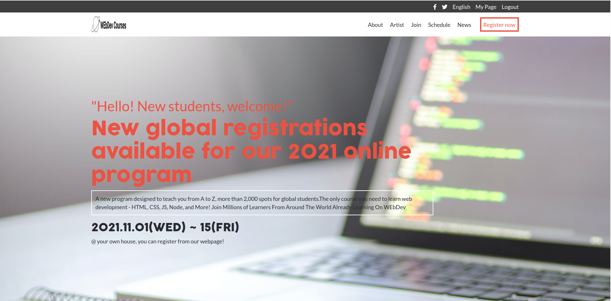

# Capstone

> The Capstone is a Microverse project where we get to practice all the things we've learned during the module. Capstone projects are solo or group projects at the end of the each of the Microverse Core Curriculum modules. Building this project is very important for you because:

   - It is similar to real-world projects you may be asked to make, and it is built with business specifications that will look really nice in your portfolio.
   - You will get feedback about the achievement of technical and soft skills gained during this module of the program.

  This Capstone was made and designed for a web development course.

Most of the project is made with basic HTML and CSS, the speakers section is made dynamically with JS.

## Built With

- HTML
- CSS
- javaScript

## Live Demo

[Live Demo Link](https://jbirdl86.github.io/Capstone/)

## Authors

👤 **Author**

- Github: [@githubhandle](https://github.com/JbirdL86)
- Twitter: [@twitterhandle](https://twitter.com/JuanLui06498455)
- Linkedin: [linkedin](https://www.linkedin.com/in/juan-luis-0551921aa/)

## 🤝 Contributing

Contributions, issues, and feature requests are welcome!

Feel free to check the [issues page](https://github.com/JbirdL86/Capstone/issues).

## Show your support

Give a ⭐️ if you like this project!

## Acknowledgments

- Microverse
- Figma 
- [Template Design By Cindy Shin](https://www.behance.net/adagio07)
- [GitHub Pages](https://pages.github.com)
- [Font Awesome](https://fontawesome.com)
- [Google Fonts](https://fonts.google.com/)
-  This work is licensed under a <a rel="license" href="http://creativecommons.org/licenses/by-nc/4.0/">Creative Commons Attribution-NonCommercial 4.0 International License</a>.

## 📝 License

This project is [MIT](./MIT.md) licensed.
